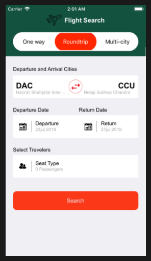

# Assignment

## Requirement
Xcode 10 and Swift 4.2

# Folder Description

### Models

Contain all the model file.

### View

Contain Storyboards.

### Controller

Contain ViewController files which control the app.

# Demo Images

## Flight Search Home Screen

